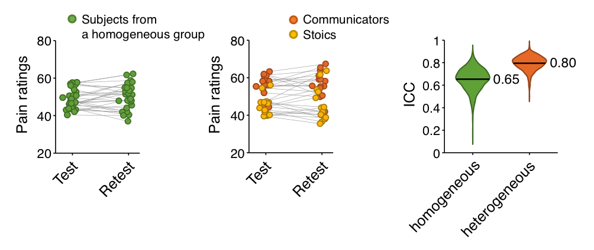

# Scripts for Woo & Wager (2015) PAIN

A simulation code (matlab) for

Woo, C.-W. & Wager, T. D. 2015, What reliability can and cannot tell us about pain report and pain neuroimaging. PAIN

You can download the paper from [here](http://wanirepo.github.io/pdfs/Woo_2015_PAIN_TRR.pdf)

## Overview

**Figure.** An illustration of the effects of sample heterogeneity on test-retest reliability of pain ratings

Reliability is generally a desirable property for any measure. However, any stable individual difference can increase reliability, independent of the validity and utility of the measure in other respects. 

To illustrate this, we simulated intra-class correlation coefficients (ICCs), a common measure of reliability, in samples (*N* = 30) consisting of one homogeneous population (green) or a mix of “communicators” that report higher pain and “stoics” that report less pain (orange and yellow, respectively). 

In the simulation, the mean pain ratings were set to 50, 55, and 45 for the homogeneous, “communicator,” and “stoic” groups.  The between-person and within-person (across test/re-test) standard deviations were set to 5 for all groups; thus, the noise levels were the same for both samples. We repeated the simulation 1000 times and observed the effects on the distribution of test-retest ICC values (right panel).

The results show that more heterogeneous samples showed higher reliability (mean ICC = 0.80) than more homogeneous samples (mean ICC = 0.65). The principle of stable heterogeneity increasing reliability applies to both individual differences of interest (e.g., genetic differences in pain sensitivity) and nuisance variables (e.g., the use of multiple experimenters or variable testing procedures), as long as their effects carry over or are otherwise stable from test to retest. 

## Dependencies for the simulation code

### ICC
ICC.m can be downloaded from [here](http://www.mathworks.com/matlabcentral/fileexchange/21501-intraclass-correlation-coefficients/content/ICC.m)

### violinplot
violinplot.m is included in [CANLab Core tools](https://github.com/canlab/CanlabCore). You can download the toolbox [here](https://github.com/canlab/CanlabCore) or using the following command line. 

	$ git clone https://github.com/canlab/CanlabCore.git
	